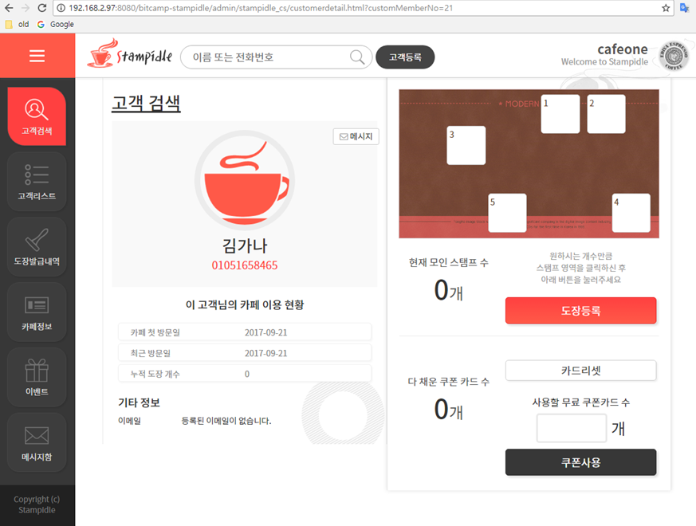
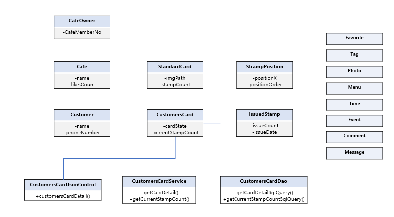

# stampidle

[web.xml](https://github.com/zeeyonchung/bitcamp-stampidle/blob/master/src/main/webapp/WEB-INF/web.xml)

[application-context.xml](https://github.com/zeeyonchung/bitcamp-stampidle/blob/master/src/main/webapp/WEB-INF/conf/application-context.xml)

[customerDetail.html](https://github.com/zeeyonchung/bitcamp-stampidle/blob/master/src/main/webapp/admin/stampidle_cs/customerdetail.html)

[customerDetail.js](https://github.com/zeeyonchung/bitcamp-stampidle/blob/master/src/main/webapp/admin/stampidle_cs/customerdetail.js)

[dispatcherServlet](https://github.com/zeeyonchung/bitcamp-stampidle/blob/master/src/main/webapp/WEB-INF/conf/json-servlet.xml)

[CustomersCardJsonControl.java](https://github.com/zeeyonchung/bitcamp-stampidle/blob/master/src/main/java/bitcamp/java89/ems2/control/json/CustomCardJsonControl.java)

[CustomersCardService.java](https://github.com/zeeyonchung/bitcamp-stampidle/blob/master/src/main/java/bitcamp/java89/ems2/service/impl/CustomCardServiceImpl.java)

[CustomersCardDao.java](https://github.com/zeeyonchung/bitcamp-stampidle/blob/master/src/main/java/bitcamp/java89/ems2/dao/CustomCardDao.java)

[CustomersCardDao.xml](https://github.com/zeeyonchung/bitcamp-stampidle/blob/master/src/main/resources/bitcamp/java89/ems2/dao/CustomCardDao.xml)